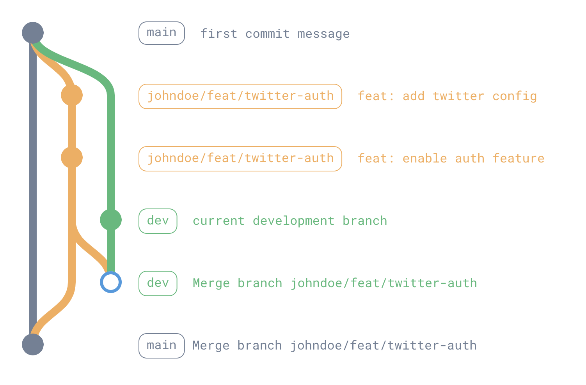

# Branch

Our branching strategy ensures a clear and organized development process. We use main for production, dev for development, and staging for testing. Feature branches follow a username/feat/feature-name format, allowing for easy tracking and collaboration.

Our branch naming convention is:

-   `main` is for production.
-   `dev` is for development.
-   `staging` is for staging.

## Naming Branch

Branches are named following the pattern:

`{username}/{type}/{description}`

-   username: the username (can be the git username)
-   type: similar to [Types](/docs/convention-git/commit#types)
-   description: description of related feature

## Development Life Cycle

-   Checkout from main. `main` ~> `johndoe/feat/twitter-auth`
-   Merge to dev for development. `johndoe/feat/twitter-auth` -> `dev`
-   Merge to main for production. `johndoe/feat/twitter-auth` -> `main`
